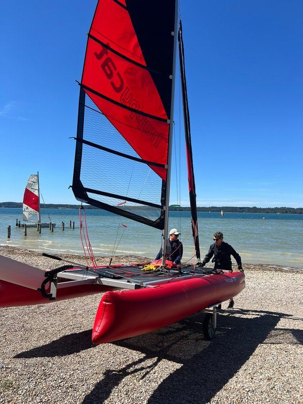

# Happy Cat Star — Improvements

Improvements and practical modifications to the **Grabner Happy Cat Star** inflatable sailing catamaran.



## Modifications

- [Slipwheel mounting spacers](modifications/slipwheel-spacers/) — keep both mounting bolts securely in place when the slipwheel arms are removed. STL and 3D preview included; installation photo to follow.

Each modification will have its own subfolder containing a Markdown guide and everything needed to understand and reproduce it: photos, drawings, 3D-printable models, CAD sources, or other supporting files.

```text
modifications/
└── modification-name/
    ├── README.md       # Purpose, materials, and installation instructions
    ├── files/          # 3D-printable models, CAD sources, drawings, etc.
    └── images/         # Photos and illustrations
```

Each guide should explain the problem being solved, list the required parts and tools, and describe how to make and install the modification. Include print settings and assembly notes where relevant, and distinguish tested changes from work in progress.
